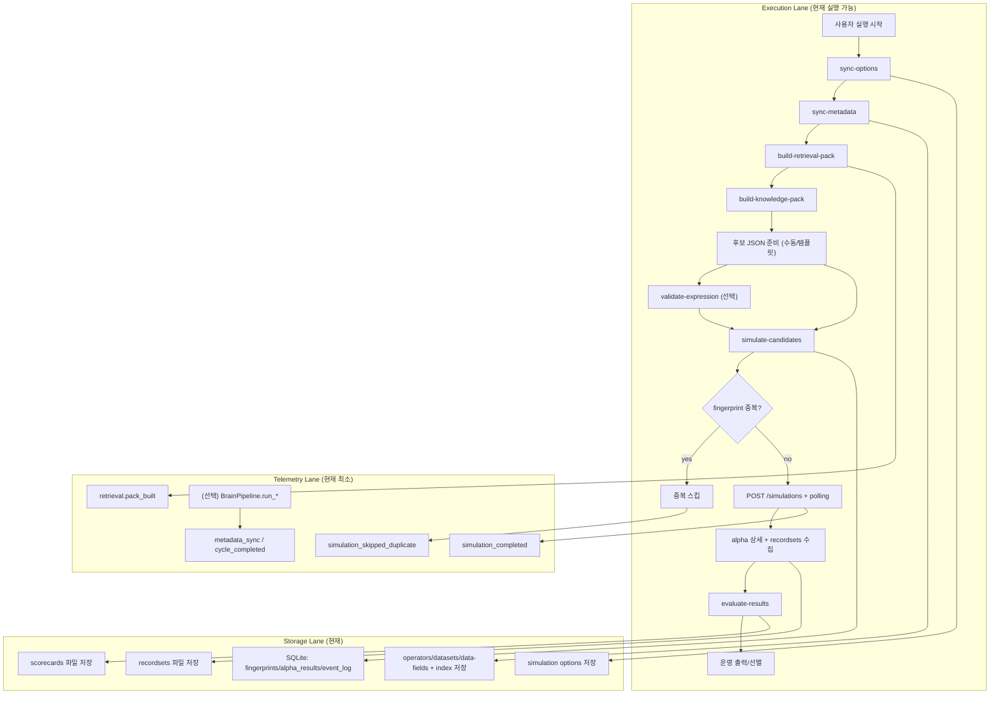
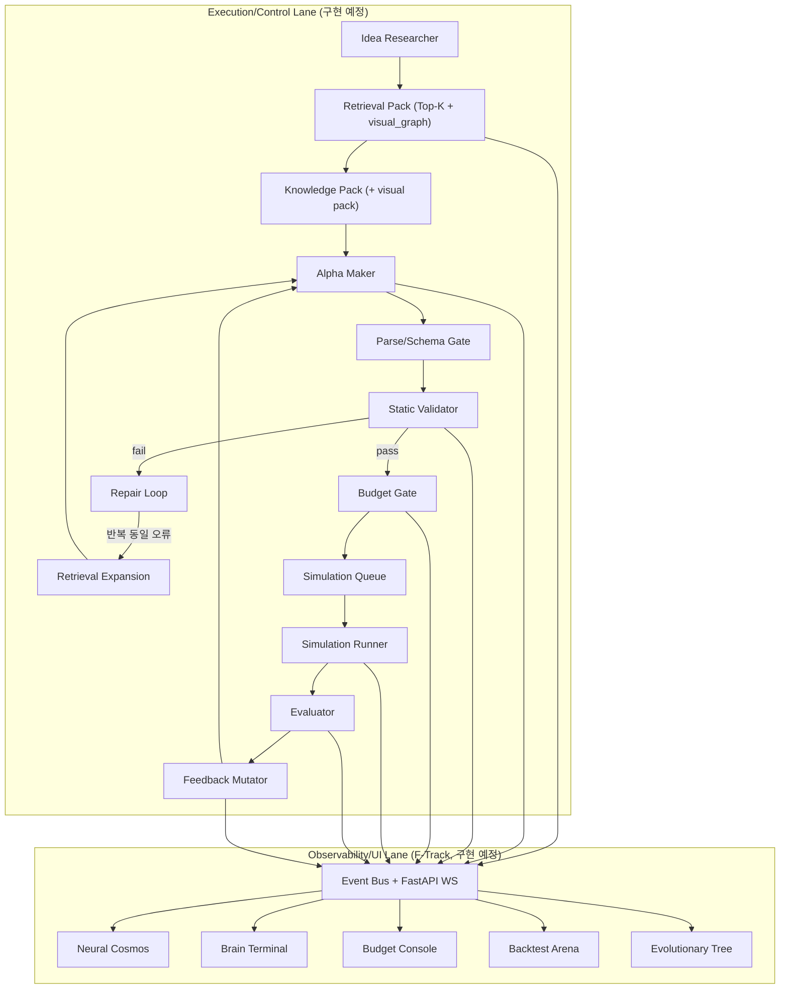

# Current Workflow Map

이 문서는 2026-02-11 기준 `main` 코드와 `docs/steps/step-17~21.md` 계획을 함께 반영한다.  
목표는 "현재 실행 경로"와 "다음 구현 경로"를 혼동하지 않게 정리하는 것이다.

## 1) 정합성 점검 요약 (코드 vs 단계 계획)

- 현재 실제 실행의 중심은 CLI/스크립트 경로다.
  - `sync-options` / `sync-metadata` / `build-retrieval-pack` / `build-knowledge-pack` / `simulate-candidates` / `evaluate-results`
- 메타데이터 동기화 + 시뮬/평가 엔진은 동작 중이다.
  - 메타 인덱스/진행 파일: `data/meta/*`
  - 결과/레코드셋: `data/simulation_results/*`, `data/recordsets/*`
  - DB: `data/brain_agent.db`
- 이벤트 로그는 이미 존재하지만 범위가 제한적이다.
  - 항상 기록: `simulation_skipped_duplicate`, `simulation_completed`, `retrieval.pack_built`
  - `BrainPipeline` 경로에서만 기록: `metadata_sync`, `cycle_completed`
- step-19의 2-agent 계약/parse-repair/event envelope/WS 브리지 골격은 구현됨.
- step-20~21의 budget gate/validation loop/Arena-Evolutionary 확장은 구현 예정 상태다.

## 2) 현재 실행 가능 흐름 (CLI 중심, 단순 직렬 + 저장/로그 레인)

- 사용자 수동 개입:
  - `scripts/setup_credentials.sh` (계정 입력)
  - 계정 정책에 따라 biometrics 인증
- 나머지는 배치 실행 가능

### 현재 사용자가 체감하는 기본 실행 순서

1. `bash scripts/setup_credentials.sh`
2. `PYTHONPATH=src bash scripts/sync_options.sh`
3. `PYTHONPATH=src bash scripts/sync_metadata.sh --region USA --delay 1 --universe TOP3000`
4. `PYTHONPATH=src python3 -m brain_agent.cli build-retrieval-pack --idea <ideaspec.json> --output <retrieval_pack.json>`
5. `PYTHONPATH=src python3 -m brain_agent.cli build-knowledge-pack --output-dir data/meta/index`
6. 후보 JSON 준비 후 `PYTHONPATH=src bash scripts/simulate_candidates.sh <input.json>`
7. `PYTHONPATH=src bash scripts/evaluate_results.sh <result.json>`

## 3) Step-20~21 확장 흐름 (step-19 구현 완료 기준, 일부 구현 예정)

핵심: 프론트엔드를 맨 마지막으로 미루지 않고, 생성/검증/예산/시뮬 파이프라인과 병렬로 관측 계약을 함께 고정한다.

## 4) 단계별 책임 경계 (architecture 관점)

### step-17
- retrieval pack + exploit/explore + `visual_graph` 계약 고정
- retrieval 이벤트 스키마 정의

### step-18
- operator/settings/examples/counterexample + `fastexpr_visual_pack` 고정
- validator 오류 분류와 연결 가능한 taxonomy 준비

### step-19
- Idea Researcher / Alpha Maker 입출력 계약 고정
- event bus + FastAPI WebSocket 브리지의 표준 이벤트 envelope 정의

### step-20
- budget/fallback/coverage/novelty telemetry 계약 고정
- 대시보드 API(`run` 단위 budget/kpi) 정의

### step-21
- validation-first + repair loop + simulation queue 진입 조건 강제
- Arena/Evolutionary Tree 재구성 가능한 이벤트 순서 계약 확정

## 5) 현재 기준 "구현됨 / 부분 / 예정" 체크

### 구현됨
- 메타데이터 동기화/인덱스 빌드 (`src/brain_agent/metadata/sync.py`, `src/brain_agent/metadata/organize.py`)
- step-17 retrieval pack 빌더 + Top-K 예산 config + retrieval 이벤트 (`src/brain_agent/retrieval/pack_builder.py`, `configs/retrieval_budget.json`, `src/brain_agent/cli.py`)
- step-18 knowledge pack 빌더 + validator taxonomy 연계 (`src/brain_agent/generation/knowledge_pack.py`, `src/brain_agent/validation/static_validator.py`, `src/brain_agent/cli.py`)
- step-19 2-agent 계약 구현 (`src/brain_agent/agents/llm_orchestrator.py`, `src/brain_agent/generation/prompting.py`, `src/brain_agent/cli.py`)
- step-19 OpenAI SDK 실연동 (`src/brain_agent/generation/openai_provider.py`, `src/brain_agent/agents/llm_orchestrator.py`)
- step-19 이벤트 표준화 + WS 브리지 골격 (`src/brain_agent/runtime/event_bus.py`, `src/brain_agent/server/app.py`, `src/brain_agent/storage/sqlite_store.py`)
- 정적 검증 (`src/brain_agent/validation/static_validator.py`)
- 시뮬/중복 스킵/결과 저장 (`src/brain_agent/simulation/runner.py`)
- 평가 및 기본 변이 로직 (`src/brain_agent/evaluation/evaluator.py`, `src/brain_agent/feedback/mutator.py`)

### 부분구현
- `BrainPipeline` 참조 오케스트레이터는 존재하나 기본 운영 경로는 아직 스크립트/CLI 중심 (`src/brain_agent/agents/pipeline.py`)
- FastAPI/uvicorn 의존성이 설치되지 않은 환경에서는 WS 서버 실행 검증이 제한됨

### 구현 예정
- step-20 budget/토큰 fallback 정책 + KPI telemetry 고도화
- step-21 validation-first repair loop + simulation queue 진입 강제
- Next.js 기반 실시간 UI
- 이벤트명 마이그레이션(신규 dotted event + 기존 snake_case alias 병행)

## 6) 상태 한 줄 정리

- 현재: "메타 동기화 + 2-agent 계약 + 시뮬레이션/평가"까지 실행 가능
- 다음: "비용 게이트(step-20) + validation-first loop(step-21) + 실시간 UI"를 결합
